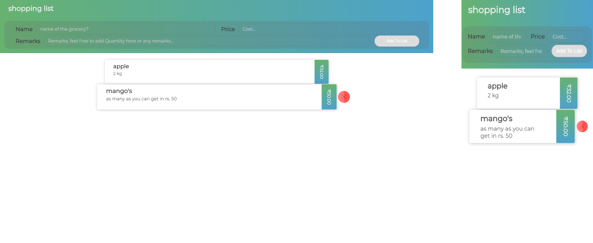

# React Grocery List
React Grocery List is a design of shopping list developed using React js. It is a template for an React developer who want to create grocery application. 

## UI
#### [LIVE DEMO](https://grocerylist-reactapp.herokuapp.com/)

Grocery list is using redux and react hook's for state managment.

## Available Scripts

In the project directory, you can run:

### `npm start`

Runs the app in the development mode. 
Open [http://localhost:3000](http://localhost:3000) to view it in the browser.

The page will reload if you make edits. 
You will also see any lint errors in the console.
